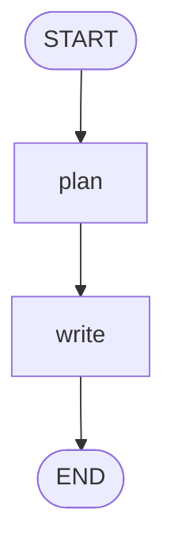

# 可视化

`to_mermaid()` 把图拓扑导出成 mermaid 文本(零依赖手写),粘到 GitHub README / 文档站 / [mermaid.live](https://mermaid.live) 即可看图。

```python
print(app.to_mermaid())
```

输出示例:

```text
graph TD
    START([START])
    END([END])
    START --> plan
    plan --> write
    write --> END
```

- 静态边画实线 `-->`;
- 条件边(带 `path_map`)画带标签虚线 `-. 标签 .->`;
- `START` / `END` 用圆角节点。

把输出贴进 Markdown 的 ` ```mermaid ` 代码块,GitHub 和文档站会自动渲染成流程图:


